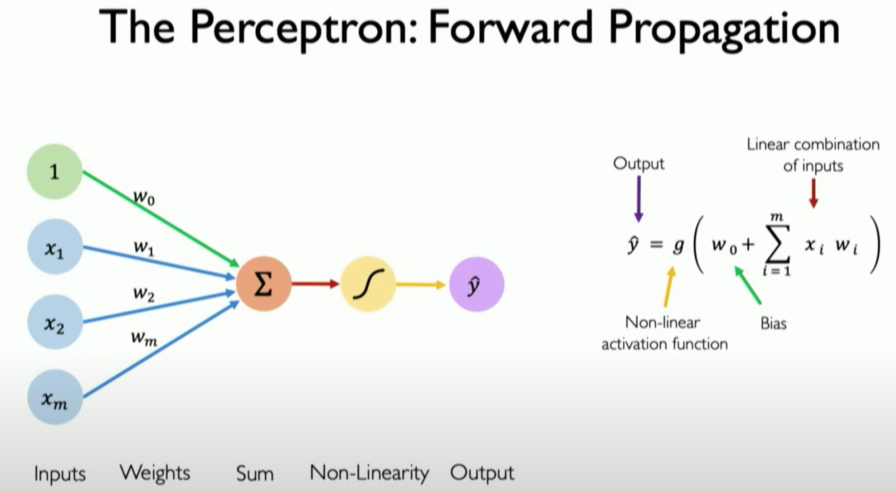

# Perceptron and Bagging Classifier

This repository contains a Python implementation of a simple Perceptron and a model-agnostic Bagging (Bootstrap Aggregating) classifier. This project is a polished and extended version of an assignment originally developed for the Artificial Intelligence course at the University of Guanajuato, serving as an introduction to Neural Networks.

## 1. The Perceptron

### What is a Perceptron?

The Perceptron is one of the earliest and simplest types of artificial neural networks. Invented by Frank Rosenblatt in 1957, it's a linear binary classifier. It takes a set of inputs, computes a weighted sum, and applies a step function to produce a binary output (0 or 1). The learning process involves adjusting the weights based on the error in its predictions, a concept that laid the groundwork for more complex neural networks.

Despite its initial promise, its limitations were famously highlighted by Marvin Minsky and Seymour Papert in their 1969 book "Perceptrons," where they showed it could only solve linearly separable problems.

The following diagram illustrates the forward propagation process, showing how inputs are combined with weights and a bias to produce an output:

<p align="center">
  
</p>

> **Note:** For a more detailed academic reference on the Perceptron model, see the course material from the University of Guanajuato: [UG_UDA_IAII (55-73)-Perceptron.pdf](docs/UG_UDA_IAII%20(55-73)-Perceptron.pdf).

### My Implementation: `perceptron.py`

The `Perceptron` class in this repository is a straightforward implementation of Rosenblatt's original concept.

**Key Characteristics:**
*   **Binary Classifier:** It is designed for two-class classification problems.
*   **Step Activation Function:** It uses a simple step function (`_f`) that outputs `1` if the linear combination of weights and inputs is greater than zero, and `0` otherwise.
*   **Learning Rule:** The model learns by iterating through the training data. For each misclassified sample, it updates its weights and bias according to the Perceptron learning rule: `weight = weight + learning_rate * (true_label - predicted_label) * input`.
*   **Initialization:** Weights are initialized with small random values to break symmetry.

This implementation serves as a foundational example of a single-layer neural network.

## 2. Bagging (Bootstrap Aggregating)

### What is Bagging?

Bagging is an ensemble machine learning technique designed to improve the stability and accuracy of machine learning algorithms. Proposed by Leo Breiman in 1994, it works by training multiple models on different random subsets of the training data (bootstrap samples) and then aggregating their predictions. For classification, this aggregation is typically done by majority vote.

The primary goal of bagging is to reduce variance, making the model less sensitive to the specific training data and less prone to overfitting.

### My Implementation: `bagging.py`

The `BaggingClassifier` class is a flexible, model-agnostic implementation of the bagging algorithm.

**Key Characteristics:**
*   **Model-Agnostic:** It can wrap any classifier object (like our `Perceptron`) as long as it exposes `fit()` and `predict()` methods. This is achieved via the `estimator_factory` parameter.
*   **Bootstrap Sampling:** It creates multiple bootstrap samples from the training data. The size of these samples is controlled by the `sample_ratio` parameter.
*   **Ensemble Training:** It trains `n_estimators` independent models, one for each bootstrap sample.
*   **Majority Vote:** For prediction, it collects the predictions from all estimators and determines the final class label by a majority vote. It includes a deterministic tie-breaking mechanism for robustness.

## Setup and Installation

To run this project, it is recommended to use a virtual environment to manage dependencies.

**1. Clone the Repository**
```bash
git clone https://github.com/vanstrouble/perceptron-bagging-from-scratch.git
cd perceptron
```

**2. Create and Activate a Virtual Environment**

You can use any virtual environment manager. As this project was developed using Conda, those instructions are provided first.

*   **Using `conda` / `miniconda` (Recommended):**
    ```bash
    # Create a new environment named 'perceptron'
    conda create --name perceptron python=3.12

    # Activate the new environment
    conda activate perceptron
    ```

*   **Using `venv` (Python's built-in):**
    ```bash
    # Create a virtual environment in a folder named 'venv'
    python3 -m venv venv

    # Activate the environment
    # On macOS/Linux:
    source venv/bin/activate
    # On Windows:
    # .\venv\Scripts\activate
    ```

**3. Install Dependencies**

Once your environment is activated, install the required packages from the `requirements.txt` file:
```bash
pip install -r requirements.txt
```

## Running the Comparison

This repository includes a comparison script, `bagging_perceptron.py`, which demonstrates the power of bagging. It compares the performance of a single `Perceptron` against a `BaggingClassifier` using multiple perceptrons on various datasets from `scikit-learn`.

With your environment still active, run the comparison script:
```bash
python src/bagging_perceptron.py
```
You will observe how the bagging ensemble often provides a significant accuracy boost, especially on more complex datasets where a single perceptron might struggle.
